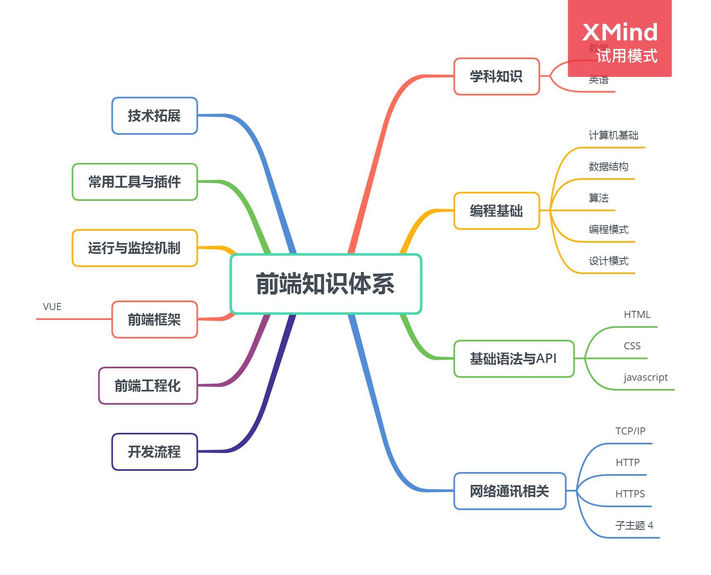

## 构建此项目的初衷

前端知识日新月异，越来越多的新技术涌现，前端技术人员需要跟上步伐学习，难免在知识的海洋淹没。构建此项目的目的，一是为了自己能够更好的梳理前端知识，形成知识体系。二是温故而知新，不能捡了芝麻丢了西瓜，三是鞭策自己保持的良好学习习惯，保持思考的头脑，不在前端的洪流中掉队。

## 前端知识体系

## 参考链接
1. [https://github.com/wangfupeng1988/what-is-fe](https://github.com/wangfupeng1988/what-is-fe)